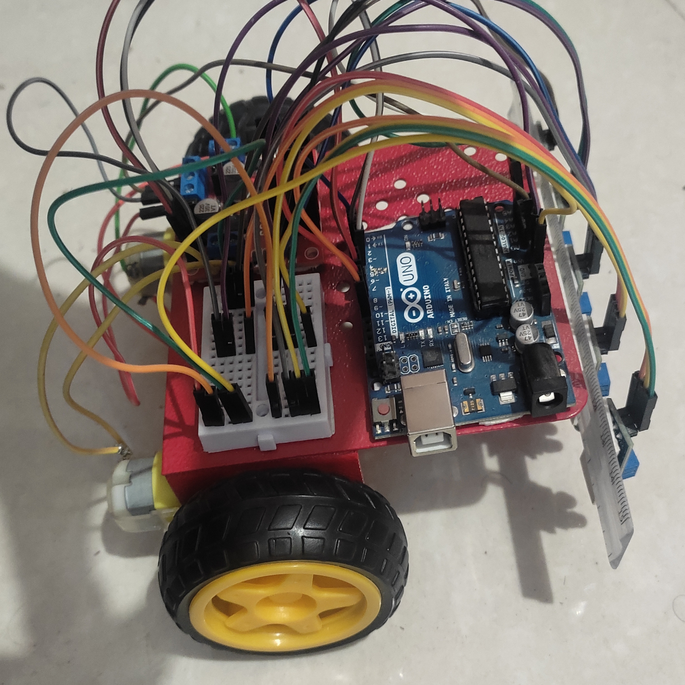
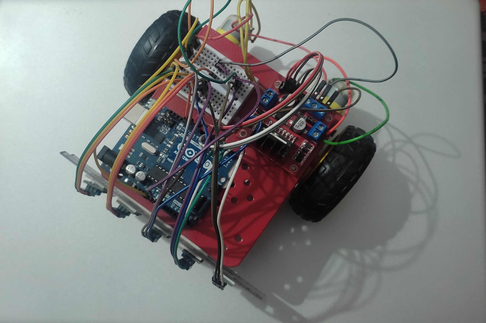
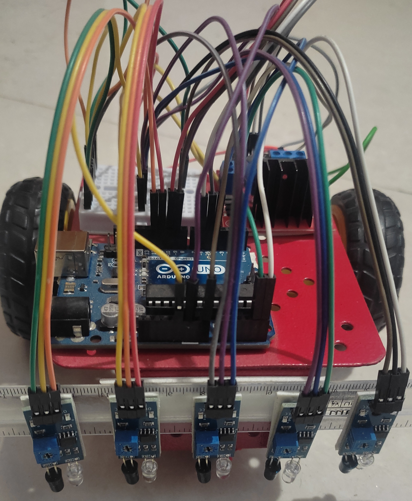
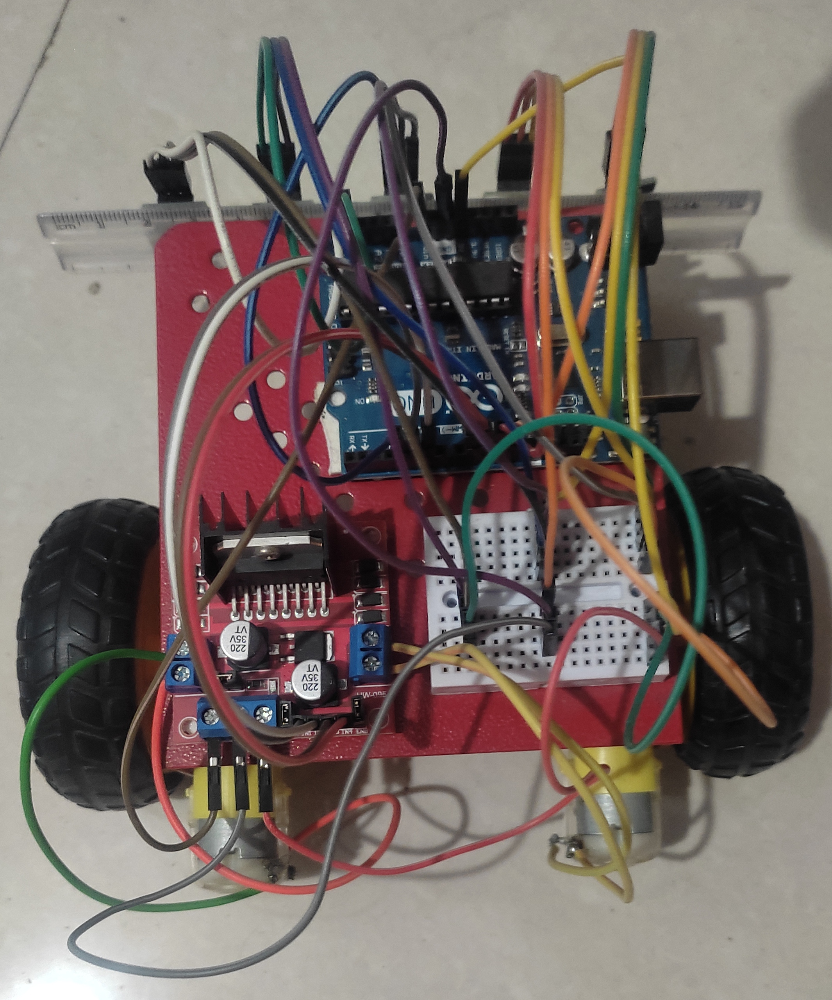

# Maze Following Robot using Arduino IDE

This project aims to build a maze following robot using an Arduino board, a motor driver, and a few sensors. The robot is programmed to detect and follow the lines of the maze until it reaches the end point.
The project involves several key stages, including designing and building the robot chassis, integrating the hardware components, and developing the algorithm(LSRB - Left, Straight, Right, Backtrack) for maze navigation. 
This project is a great example of how robotics and programming can be used to solve real-world problems

## Hardware Equipments
* Arduino Uno with cable
* Motor driver (L298 or similar)
* IR Sensor(5x)
* DC motors (2x)
* Breadboard
* Jumper wires
* 9V battery and connector
* Chassis and wheels

## Software Requirements 
* Arduino IDE

## Functionality
The maze following robot is designed to navigate through a maze by detecting the lines using ir sensors. The robot will follow the lines on its left-hand side until it reaches the end point. The motor driver will be used to control the speed and direction of the DC motors, while the ir sensors will be used to detect the marked lines. The Arduino board will receive sensor data from the  sensors and use it to control the motor driver, ensuring that the robot follows the line and avoids deviation.
## Repository Structure
* code/: Contains the Arduino code for the maze following robot.
* images/: Contains images of the robot's hardware.
* README.md: Contains project documentation.
## Screenshots

## How to use
1. Clone or download the repository to your computer.
2. Connect the hardware components.
3. Open the code/maze_follower.ino file in the Arduino IDE.
4. Upload the code to the Arduino board.
5. Power up the robot using the 9V battery.
6. Place the robot at the entrance of the maze and let it navigate .
